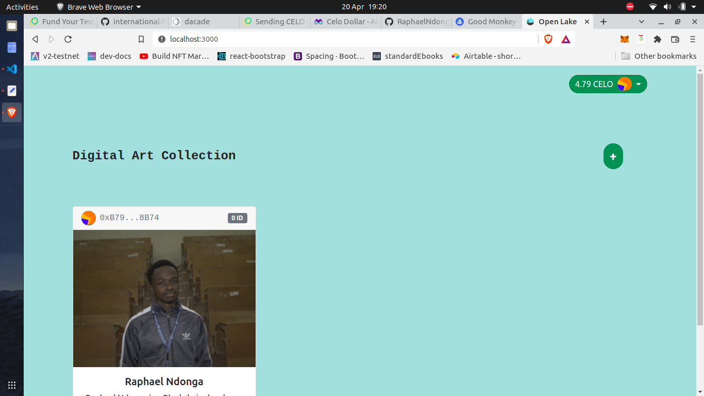

# [PROJECT LINK](https://raphaelndonga.github.io/open-lake)

      <h1>  OPEN LAKE</h1>
     

## 1. Project Functionality
This project is inspired by the celo-react-boilerplate tutorial. It involved creating and displaying nfts. This project goes a step further by enabling the buying and selling of nfts on the platform. 

To 'sell' an nft, you send it to a smart contract that has the capability to accept 
ERC721 tokens, called an ERC721Holder. This only charges a gas fee. The seller's address is stored within the smart contract.

To 'buy' an nft, you receive it from the same smart contract. You have to give some cUsd first before you can receive the nft. When the smart contract sends out the nft to the buyer, it compensates the seller.

## 2. Tech Stack
This boilerplate uses the following tech stack:
- [React](https://reactjs.org/) - A JavaScript library for building user interfaces.
- [use-Contractkit](contractkit
) - A frontend library for interacting with the Celo blockchain.
- [Hardhat](https://hardhat.org/) - A tool for writing and deploying smart contracts.
- [Bootstrap](https://getbootstrap.com/) - A CSS framework that provides responsive, mobile-first layouts.

